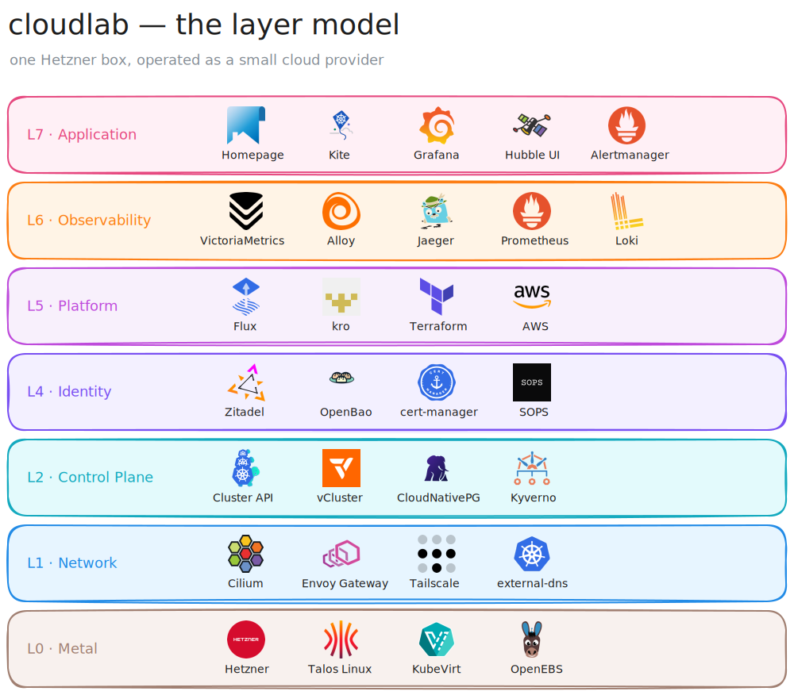

# CloudLab ☁️

<p align="center">
  <strong>A single Hetzner dedicated server, operated as if it were a small cloud provider</strong>
</p>

<p align="center">
  <a href="#-features">Features</a> •
  <a href="#-quick-start">Quick Start</a> •
  <a href="#-tooling-stack">Tooling Stack</a> •
  <a href="#-architecture">Architecture</a> •
  <a href="#-roadmap">Roadmap</a> •
  <a href="#-contributing">Contributing</a>
</p>

<p align="center">
  
  
  
  
  
</p>

The management cluster **is** the cloud API: VMs, networks, clusters, DNS,
identity clients, and policies are all CRDs reconciled from Git. The design
deliberately mirrors AWS concepts — VPC, security groups, NLB, IRSA — rebuilt
from CNCF primitives on one bare-metal box.

---

## 🌟 Features

- **☁️ Cloud-as-CRDs**: every piece of infrastructure is declarative, in Git, reconciled by a controller — no imperative snowflake state
- **🌐 IPv6-first**: a routed `/56` is the native addressing plane; every pod holds a globally routable GUA, and reachability is a policy decision, never a NAT accident
- **🔐 Identity everywhere**: humans, workloads, and clusters authenticate via OIDC — IRSA-at-home federates cluster service accounts into AWS, Zitadel, and OpenBao with **zero static credentials**
- **🕳️ Tiny public surface**: the internet sees two IPs and three ports; operators see everything, over the tailnet
- **🛡️ Security groups, distributed**: four enforcement planes (Talos nftables, Cilium eBPF identity policy, LB-IPAM pool selectors, Tailscale ACLs) — no chokepoint router
- **🔭 Observability behind SSO**: VictoriaMetrics/Logs/Traces + Grafana + Hubble flows, every UI fronted by OIDC at the gateway
- **♻️ Rebuildable**: the host is cattle — rescue mode to a bare management cluster in ~30 minutes, everything else reconverges from this repo

<p align="center">
  <a href="docs/architecture.excalidraw">
    
  </a>
</p>

---

## 🚀 Quick Start

```bash
# 0. Flash Talos from Hetzner rescue mode (one-time; disk serials pinned in talos/)
ID=$(curl -sX POST --data-binary @talos/schematic.yaml https://factory.talos.dev/schematics | jq -r .id)
xz -dc talos.raw.xz | dd of=/dev/disk/by-id/<system-disk> bs=4M && reboot

# 1. Generate machine config and bootstrap the node
cd talos && talhelper genconfig
talosctl apply-config --insecure -n 65.21.143.251 --file clusterconfig/cloudlab-mgmt-quasar.yaml
talosctl bootstrap && talosctl kubeconfig

# 2. Bootstrap the CNI — the one hand-installed layer
helm install cilium cilium/cilium -n kube-system -f system/cilium/values.yaml

# 3. Hand the box to GitOps — Flux reconciles everything else from this repo
kubectl apply -k system/flux-system
flux get kustomizations --watch
```

> [!IMPORTANT]
> Sweep for placeholders before applying anything: `grep -rn CHECKME .`
> Secrets are SOPS-encrypted against AWS KMS (`alias/cloudlab-sops`) — no keys
> live in-cluster; Flux decrypts via the published cluster OIDC issuer.

## 🧰 Tooling Stack

| Logo | Name | Description |
|:---:|---|---|
| <a href="https://www.talos.dev/"></a> | Talos Linux | Immutable, API-only Kubernetes OS — no SSH, no shell, declarative firewall |
| <a href="https://fluxcd.io/"></a> | Flux | GitOps root — this repo is the single source of truth |
| <a href="https://cilium.io/"></a> | Cilium | eBPF networking — dual-stack native routing, LB-IPAM, identity policy, Hubble |
| <a href="https://gateway.envoyproxy.io/"></a> | Envoy Gateway | The edge — TLS, OIDC at the gateway, SNI passthrough to workload apiservers |
| <a href="https://cert-manager.io/"></a> | cert-manager | Wildcard certificates via Route53 DNS-01 |
| <a href="https://kubernetes-sigs.github.io/external-dns/"></a> | external-dns | AAAA-first DNS records for the declared surface |
| <a href="https://tailscale.com/"></a> | Tailscale | Admin plane — subnet router advertising the Service CIDR only |
| <a href="https://zitadel.com/"></a> | Zitadel | OIDC IdP — humans → clusters (kubelogin) and apps (SSO by default) |
| <a href="https://openbao.org/"></a> | OpenBao | Secret custody — keyless AWS KMS auto-unseal via pod identity |
| <a href="https://getsops.io/"></a> | SOPS | Secrets encrypted in Git against AWS KMS |
| <a href="https://kyverno.io/"></a> | Kyverno | Policy engine — injects AWS pod identity for IRSA-at-home |
| <a href="https://openebs.io/"></a> | OpenEBS | LocalPV-LVM — thin LVs + CSI snapshots on the NVMe PV pool |
| <a href="https://cloudnative-pg.io/"></a> | CloudNativePG | Postgres operator backing Zitadel & friends |
| <a href="https://victoriametrics.com/"></a> | VictoriaMetrics | Metrics, logs, and traces at ~⅓ the RAM of the Prometheus stack |
| <a href="https://grafana.com/"></a> | Grafana | Dashboards behind SSO; Alloy ships pod logs, events, and OTLP traces |
| <a href="https://www.terraform.io/"></a> | Terraform | Record of the AWS footprint — KMS key, IAM OIDC provider, Route53 zone |

**On deck** (Phases 3–4): <a href="https://kubevirt.io/">KubeVirt</a> (EC2 at home — VMs as CRs),
<a href="https://cluster-api.sigs.k8s.io/">Cluster API</a> (EKS at home — Talos clusters stamped inside VMs),
<a href="https://www.vcluster.com/">vCluster</a> (EKS-lite at ~500 MB), and
<a href="https://kro.run/">kro</a> (the platform API — `CloudlabCluster` in one apply).

### The self-hosting backlog

Wishlist, not deployed — earmarked for when the fleet exists to host them:

| Logo | Name | Description |
|:---:|---|---|
| <a href="https://forgejo.org/"></a> | Forgejo | Self-hosted forge — Gitea's community hard fork; Forgejo Actions speaks GitHub-Actions syntax |
| <a href="https://woodpecker-ci.org/"></a> | Woodpecker CI | Container-native CI in a single Go binary — or skip it and lean on Forgejo Actions |
| <a href="https://zotregistry.dev/"></a> | zot | OCI-native registry (CNCF) — single binary, no database |
| <a href="https://github.com/gimlet-io/capacitor"></a> | Capacitor | A general-purpose Flux UI; Headlamp + Flux plugin is the kubernetes-sigs route (decision #13's revisit clause) |
| <a href="https://docs.renovatebot.com/"></a> | Renovate | Dependency PRs against this repo — HelmRelease pins and images stay fresh |
| <a href="https://garagehq.deuxfleurs.fr/"></a> | Garage | S3 at home — Rust, geo-distribution optional, far lighter than MinIO |
| <a href="https://velero.io/"></a> | Velero | The off-box backup path §9 demands before any PV is allowed to matter |
| <a href="https://ntfy.sh/"></a> | ntfy | Pub-sub push notifications — Alertmanager → phone with zero vendor |
| <a href="https://n8n.io/"></a> | n8n | Workflow automation and AI-agent glue |
| <a href="https://www.home-assistant.io/"></a> | Home Assistant | The *home* half of the homelab — still unrivaled |

## 🏗️ Architecture

Full design record in [`ARCHITECTURE.md`](./ARCHITECTURE.md); addressing
contract in [`SUBNET-PLAN.md`](./SUBNET-PLAN.md). The TL;DR:

**The AWS translation table.** EC2 → KubeVirt VMs · EKS → Cluster API +
Talos-in-VM clusters · VPC → per-cluster `/64` trio · Security Groups → four
distributed enforcement planes · NLB → Envoy `:6443` SNI passthrough ·
Route 53 → external-dns · IAM → Zitadel OIDC + SA-issuer federation ·
Secrets Manager → OpenBao · CloudFormation → kro · CloudWatch → VictoriaMetrics.

**Addressing.** IPv4 is scarce, so it's structural: `.251` answers only
mutually-authenticated management planes, `.224` lives in a one-address
LB-IPAM pool only the edge Gateway can claim — no rule review can leak public
v4, because there is nothing to leak. IPv6 is abundant, so it's declared:
pods hold GUAs from the routed `/56` (native egress, policy-dark ingress),
and the only *served* v6 addresses come from an opt-in, Git-reviewed LB pool.

**Security.** There is no chokepoint router. Enforcement is attached to
identity, not topology: Talos nftables police host-destined traffic, Cilium
eBPF polices services and pods, Tailscale ACLs police the admin plane.
East–west is explicit — a namespace gets a `baseline` or `baseline-strict`
policy tier, and everything else is a written `CiliumNetworkPolicy`.

**GitOps.** One `system/` directory = one component = one Flux Kustomization,
with explicit `dependsOn` ordering. Cilium's Helm layer is the single
bootstrap-installed piece; apps follow the same pattern under `apps/`.
Nineteen recorded decisions (and their revisit conditions) live in the
[decision log](./ARCHITECTURE.md#11-decision-log).

**Honest non-goals.** One node = one AZ = zero failover. No production SLAs,
no replicated storage — HA affordances are interfaces today and become
guarantees only with hardware plurality.

## 📦 Project Structure

```
cloudlab/
├── ARCHITECTURE.md          canonical design record — start here
├── SUBNET-PLAN.md           the addressing contract
├── talos/                   host config: talconfig · factory schematic · patches
├── tailscale/               tailnet ACL policy
├── aws/                     Terraform: KMS key · IAM OIDC provider · Route53 zone
├── system/                  one dir = one component = one Flux Kustomization
│   ├── flux-system/         GitOps root + the Kustomization dependency DAG
│   ├── cilium/              bootstrap Helm values · LB-IPAM pools
│   ├── edge/                Gateway · wildcard cert · HTTP→S redirect
│   ├── identity/            OIDC publication · AWS pod identity (IRSA-at-home)
│   ├── monitoring/          VictoriaMetrics stack · Alloy · SSO'd UIs
│   ├── policies/            reusable network-policy baselines + examples
│   └── ...                  cert-manager · envoy-gateway-system · external-dns
│                            kyverno · openebs · cloudnative-pg · tailscale
├── apps/                    one dir per app + a ks in system/flux-system
│   ├── zitadel/             the IdP (on a CNPG database)
│   ├── openbao/             secret custody
│   ├── homepage/            the hub — routes self-register via annotations
│   └── kite/                cluster console
└── docs/                    the layer diagram (.excalidraw source + rendered svg)
```

Each `system/` directory is everything one component needs — HelmRelease,
config CRs, its namespace's Cilium policies — and maps to exactly one Flux
Kustomization. Secrets are SOPS-encrypted in place; nothing sensitive lives
in the repo in plaintext.

## 🗺️ Roadmap

- ✅ **Phase 1 — network baseline**: Talos + firewall + Tailscale, Cilium dual-stack, LB pools, Envoy edge, policy tiers
- 🚧 **Phase 4 — identity & platform** (started early): Zitadel + structured authn, gateway OIDC, IRSA-at-home, OpenBao; kro still ahead
- 📅 **Phase 2 — hardening**: Hetzner virtual MAC + Multus, Tailscale operator, VyOS-as-VM for routed tenant bridges
- 📅 **Phase 3 — the fleet**: KubeVirt + CDI, CAPI-stamped Talos clusters on their `/64` trios, vCluster lane
- 📅 **Phase N — box #2**: ClusterMesh, replicated storage, HA stops being theater

## 🤝 Contributing

This is a lab — one box, one operator — but issues, ideas, and PRs are
welcome. Ground rules:

1. **Argue with the decision log.** Every choice in
   [ARCHITECTURE.md §11](./ARCHITECTURE.md#11-decision-log) has a *because*
   and a *revisit when*; the best proposals engage one of those instead of
   relitigating from scratch.
2. **Follow the shape.** One directory = one component = one Flux
   Kustomization, with explicit `dependsOn` — no loose manifests.
3. **No plaintext secrets.** Anything sensitive is SOPS-encrypted against
   the KMS key; `grep -rn CHECKME .` before assuming a value is real.
4. **Standard flow.** Fork → feature branch → PR with a clear "why".

## 📄 License

This project is licensed under the MIT License — see the [LICENSE](LICENSE) file for details.
